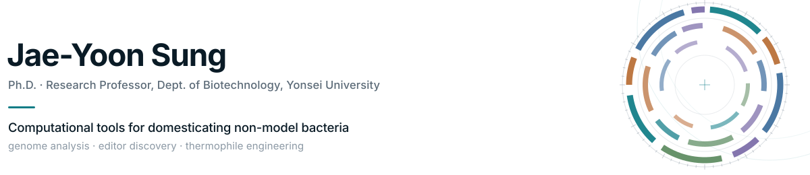
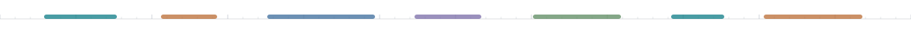

<picture>
  <source media="(prefers-color-scheme: dark)" srcset="./assets/header-dark.svg">
  
</picture>

Most of biotechnology runs on a handful of domesticated organisms. I work on the
rest — thermophiles and other extremophiles that carry chemistry worth having but
arrive with annotation nobody has checked, no genetic parts, and no pipeline built
for them. Nearly everything below began as a step in that problem with no tool
attached to it, so I wrote one.

**Research Professor** · Dept. of Biotechnology, Yonsei University · Seoul, Korea 
**Working on** — synthetic and systems biology of non-model thermophiles, genome editors beyond Cas9, protein engineering through orthogonal replication 
**Mostly with** — *Geobacillus*, *Fervidobacterium*, and their thermophilic neighbours

  
  
  
  
  

## Selected work

### Genome analysis & domestication

- **[DNMB](https://github.com/JAEYOONSUNG/DNMB)** — One GenBank in, a domestication-ready picture out: functional annotation in a readable table, codon usage, and ribosome-binding-site preference and spacing.
- **[DNMBsuite](https://github.com/JAEYOONSUNG/DNMBsuite)** — The same pipeline as a Docker image. You supply GenBank files; it fetches and caches the module databases itself.
- **[DNMBcluster](https://github.com/JAEYOONSUNG/DNMBcluster)** — Pan-genome clustering with the comparative figures already drawn.
- **[GenomeDrawer](https://github.com/JAEYOONSUNG/GenomeDrawer)** — Circos-style circular genome maps from an annotated genome.
- **[BPGAconverter](https://github.com/JAEYOONSUNG/BPGAconverter)** — Turns BPGA pan-genome output into tables you can actually analyse.

### Editors, mobile elements, and the primers to test them

- **[DNMBeditor](https://github.com/JAEYOONSUNG/DNMBeditor)** — Editor evidence and guide design from a single GenBank: CRISPR–Cas (Cas9/12/13 plus multi-subunit Type I, III and IV), TnpB, and IS110 bridge recombinases, in one namespace.
- **[TnpBfinder](https://github.com/JAEYOONSUNG/TnpBfinder)** — ωRNA discovery for TnpB in IS200/IS605-family transposons.
- **[BridgeRNAscan](https://github.com/JAEYOONSUNG/BridgeRNAscan)** — Bridge RNA discovery for IS110/IS1111 recombinases.
- **[MethREfinder](https://github.com/JAEYOONSUNG/MethREfinder)** — Methylation-sensitive restriction sites checked against REBASE — the barrier that quietly kills transformation.
- **[FINDER](https://github.com/JAEYOONSUNG/FINDER)** — Degenerate primers designed from conserved sequence, for pulling homologues out of a metagenome.
- **[mRNAcal](https://github.com/JAEYOONSUNG/mRNAcal)** — mRNA region extraction and RNA secondary structure through ViennaRNA.

### Software with a front door

- **[Gene Studio](https://github.com/JAEYOONSUNG/GeneStudio-releases)** — A plasmid workbench that runs from one HTML file: circular and linear maps, digests with a simulated gel, PCR, Gibson and Golden Gate, guide design, and `.ab1` review. Builds are public; the source is not.
- **[PostGrabbit](https://github.com/JAEYOONSUNG/PostGrabbit)** — A desktop app that finds academic job postings, scores them against your CV, and tracks the PIs behind them. Everything stays on your own machine.

## Built with

  
  
  
  
  
  

Leaning on BLAST+, HMMER, MMseqs2, MAFFT, IQ-TREE 2, Infernal, ViennaRNA,
InterProScan, eggNOG-mapper and ChimeraX — and on REBASE, MEROPS and dbCAN for
the reference data.

<picture>
  <source media="(prefers-color-scheme: dark)" srcset="./assets/rule-dark.svg">
  
</picture>

Happy to talk about thermophile engineering, editor discovery, or anything that makes a non-model organism tractable — <a href="mailto:o3wodbs@gmail.com">o3wodbs@gmail.com</a> · <a href="https://open.kakao.com/o/sDSWN5Xg">KakaoTalk</a>
